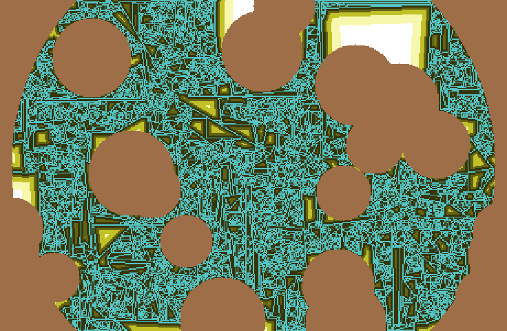

# Granulair-Fluid-Simulation

This project simulates **granular fluid behavior** using **NetLogo**, a multi-agent programmable modeling environment. The goal is to model and visualize how particles interact under gravity and flow-like conditions, similar to the dynamics of materials such as sand, grains, or powder.

---

## 🧪 Project Summary

- Each particle is represented as an agent (turtle) in NetLogo.
- Particles are subject to simple physical rules:
  - Gravity-based vertical motion
  - Lateral displacement when blocked
  - Collisions and stacking effects
- The simulation can produce **realistic-looking granular flow**, pile formation, and chaotic settling patterns.

---

## 📁 Repository Contents

| File | Description |
|------|-------------|
| `Granular fluid simulation.nlogo` | NetLogo simulation file |
| `Snapshot_interesting_pattern.png` | Example output visualization |
| `raw_code` | Source reference or notes (not used directly by NetLogo) |

---

## ▶️ How to Run

1. Download and install [NetLogo](https://ccl.northwestern.edu/netlogo/).
2. Open NetLogo and load the file:  
   `Granular fluid simulation.nlogo`
3. Click **Setup** to initialize the environment.
4. Click **Go** to start the simulation.

> You can experiment with parameters like particle count, drop speed, spread, or boundary conditions if the model exposes them via sliders or code.

---

## 🔬 Possible Extensions

- Add more physics realism (e.g. friction, inter-particle forces)
- Enable user-defined barriers or channels
- Visualize flow pressure or direction with vector fields
- Export simulation data to CSV or image series

---

## 📄 License

No license specified. This project is for educational and experimental purposes.

---
